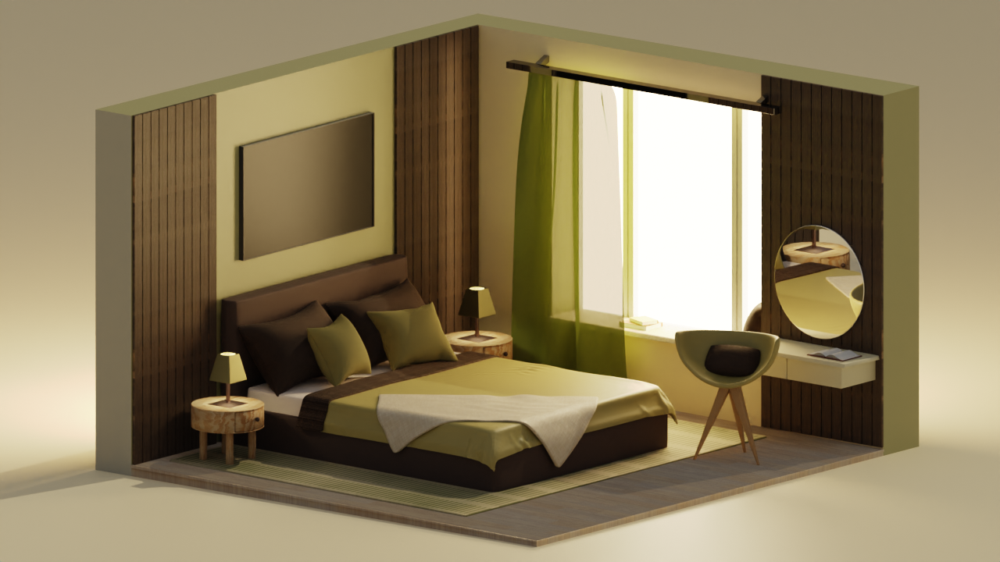
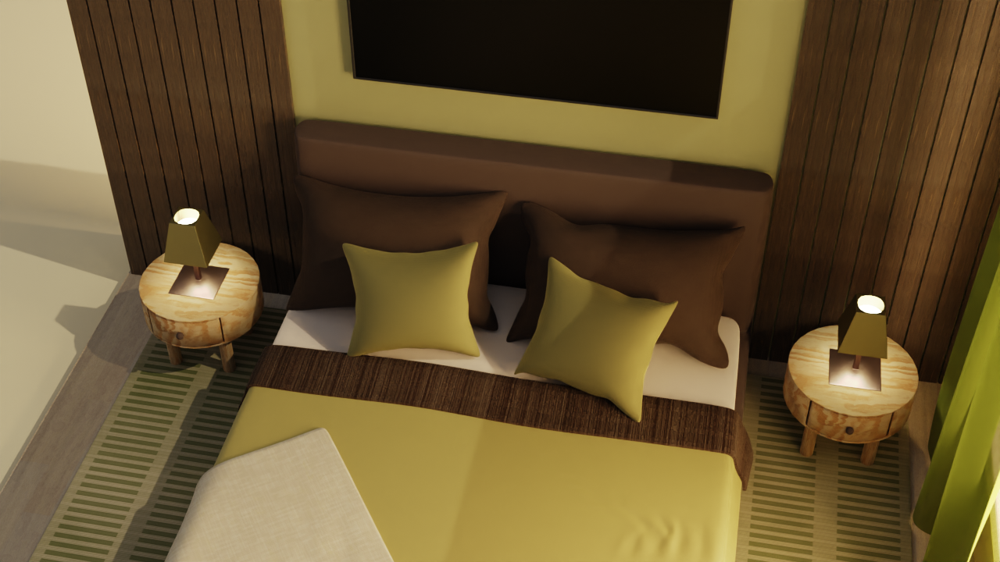
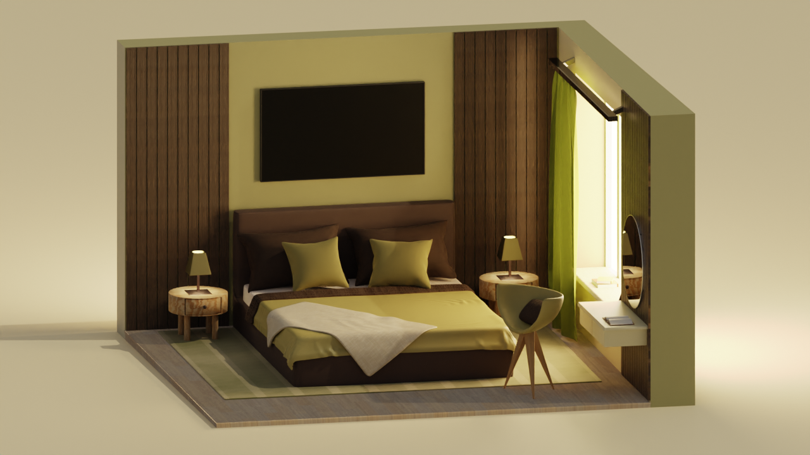

# Isometric Cozy Green Bedroom

This Blender project brings together the warmth and the comfort. Wood pannels, designed carpet, all meticulously crafted using different textures.
The result is a serene and inviting isometric bedroom that exudes tranquility.

As a passionate 3D artist, I believe in the power of simplicity and its ability to create impactful visuals.

If you appreciate my work and would like to support me or collaborate on a project, please feel free to reach out to me via email at dstanilevichi@gmail.com. I am always open to new ideas and partnerships in the world of 3D graphics, and any contributions or feedback are greatly appreciated.

If you're interested in seeing more of my 3D art, I invite you to visit my ArtStation portfolio at https://www.artstation.com/daria_stnl. 
There, you can find a wider variety of my personal and professional works, as well as my latest updates and projects.

Thank you for visiting my repository, and I hope you enjoy my Blender creations!

