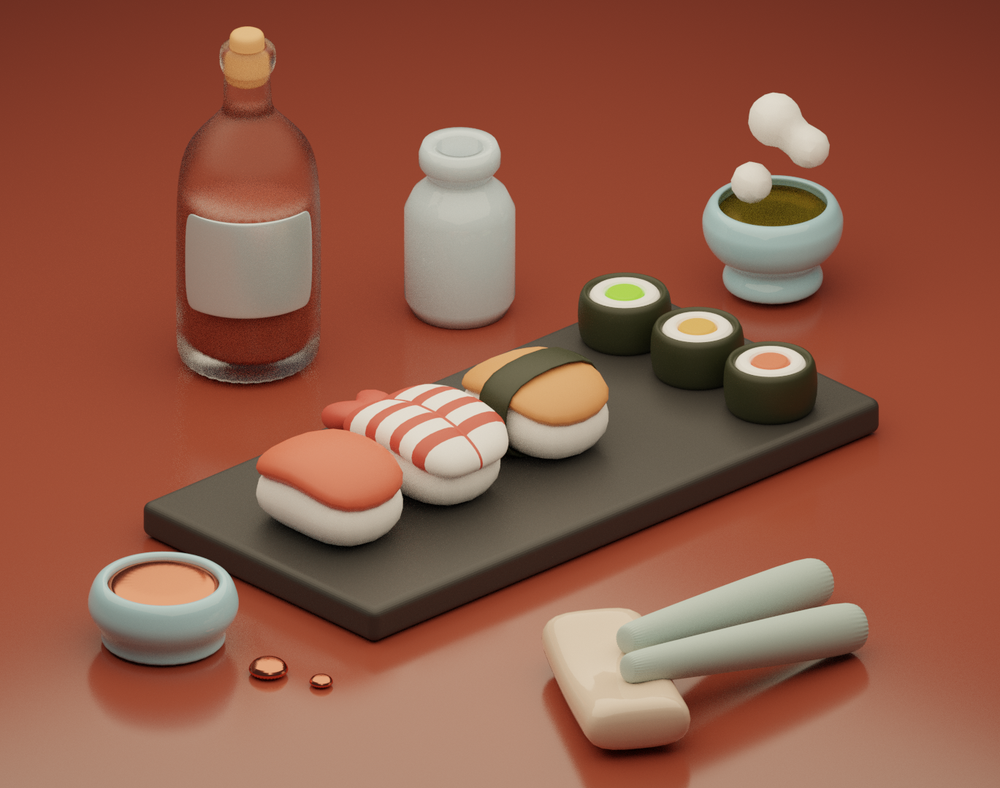

# Sushi

As a sushi lover, I was inspired to create this model to celebrate one of my favorite dishes. 
I meticulously crafted every detail of the sushi using Blender's powerful modeling tools, resulting in a realistic representation of this popular Japanese delicacy.

My passion for sushi led me to invest significant time and effort into creating this model, ensuring that every aspect of the sushi was accurately replicated. 
From the rice to the delicate placement of the fish and garnishes, I strived for realism and perfection in every detail.

I hope that my sushi model will inspire others to appreciate the artistry and beauty of Japanese cuisine.

If you appreciate my work and would like to support me or collaborate on a project, please feel free to reach out to me via email at dstanilevichi@gmail.com. I am always open to new ideas and partnerships in the world of 3D graphics, and any contributions or feedback are greatly appreciated.

If you're interested in seeing more of my 3D art, I invite you to visit my ArtStation portfolio at https://www.artstation.com/daria_stnl. 
There, you can find a wider variety of my personal and professional works, as well as my latest updates and projects.

Thank you for visiting my repository, and I hope you enjoy my Blender creations!

