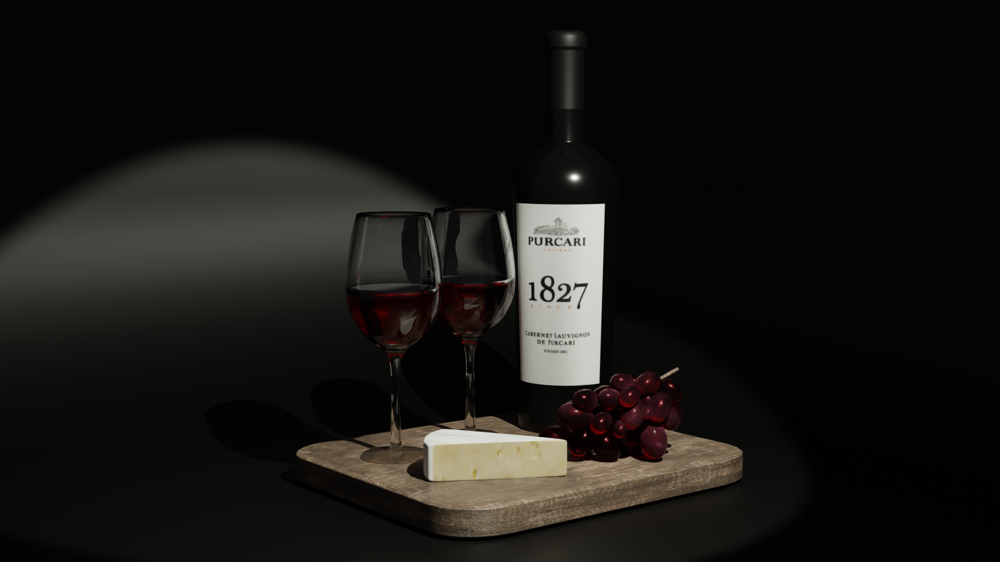
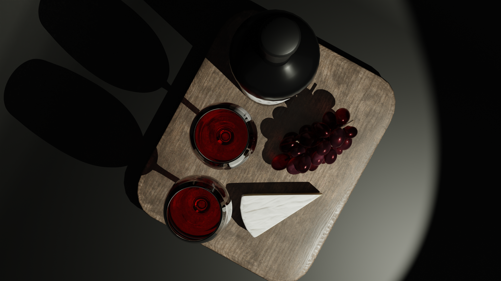
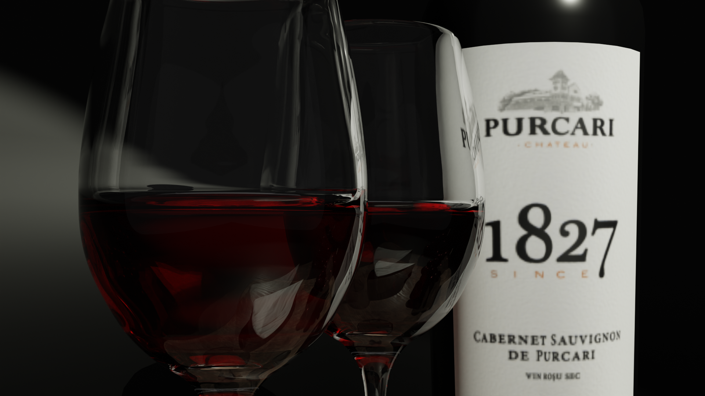

# Wine

Since I am coming from Moldova, I decided to do the 3D model of a wine bottle for the prestigious PURCARI 1827 winery based in my country.
The goal of this project is to create a realistic and visually appealing 3D representation of the PURCARI 1827 wine bottle with basic plate of dishes like grape and cheese.

If you appreciate my work and would like to support me or collaborate on a project, please feel free to reach out to me via email at dstanilevichi@gmail.com. 
I am always open to new ideas and partnerships in the world of 3D graphics, and any contributions or feedback are greatly appreciated.

If you're interested in seeing more of my 3D art, I invite you to visit my ArtStation portfolio at https://www.artstation.com/daria_stnl. 
There, you can find a wider variety of my personal and professional works, as well as my latest updates and projects.

Thank you for visiting my repository, and I hope you enjoy my Blender creations!

